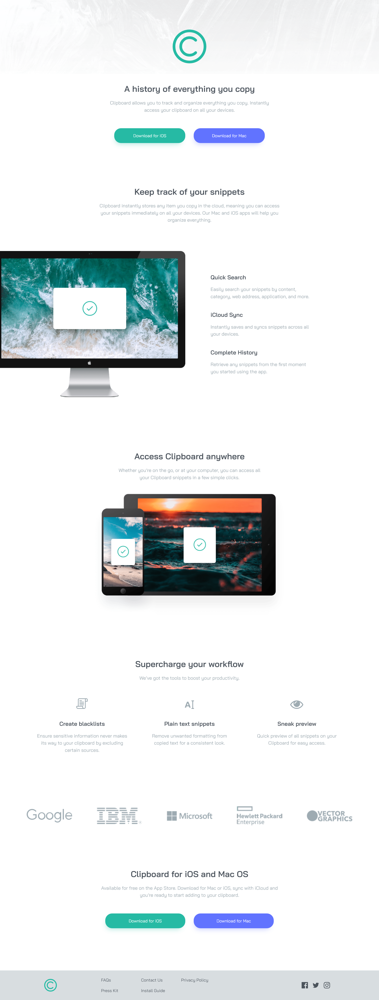

# Frontend Mentor - Clipboard landing page solution

This is a solution to the [Clipboard landing page challenge on Frontend Mentor](https://www.frontendmentor.io/challenges/clipboard-landing-page-5cc9bccd6c4c91111378ecb9). Frontend Mentor challenges help you improve your coding skills by building realistic projects. 

## Table of contents

- [Overview](#overview)
  - [The challenge](#the-challenge)
  - [Screenshot](#screenshot)
  - [Links](#links)
- [My process](#my-process)
  - [Built with](#built-with)
  - [What I learned](#what-i-learned)
  - [Continued development](#continued-development)
- [Author](#author)

**Note: Delete this note and update the table of contents based on what sections you keep.**

## Overview

### The challenge

Users should be able to:

- View the optimal layout for the site depending on their device's screen size
- See hover states for all interactive elements on the page

### Screenshot

### Links

- Solution URL: [Github](https://github.com/CHEN-YiWen/clipboard-landing-page-master)
- Live Site URL: [live site hosted by Github](https://chen-yiwen.github.io/clipboard-landing-page-master/)

## My process

### Built with

- Semantic HTML5 markup
- CSS custom properties
- Flexbox

### What I learned

- Overall, I think this challenge isn't too difficult. I used <code>display: flex</code> to create similar layout as the design. 
- The part that took me some time was placing the computer image in the desktop design. At first, I tried to use <code>position: absolute</code> and <code>position: relative</code>. However, I found it was way easier to simply set margin in minus.

### Continued development
- I would like to try styling the whole page again with <code>display: grid</code>
- When I resize the viewport for the desktop design, the internal links in the footer will trun into three rows instead of two. I still need to figure how to make it stick to two rows. 

## Author

- Frontend Mentor - [@CHEN-YiWen](https://www.frontendmentor.io/profile/CHEN-YiWen)
